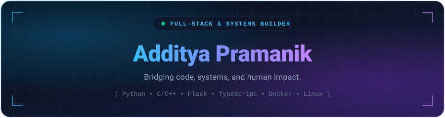

<!-- ======================================================= -->
<!-- HEADER BANNER -->
<!-- ======================================================= -->
<p align="center">
  
</p>

<!-- ======================================================= -->
<!-- DYNAMIC TYPING SUBTITLE -->
<!-- ======================================================= -->
<div align="center">
  <a href="https://github.com/theadditya">
    
  </a>
</div>

<!-- ======================================================= -->
<!-- QUICK SOCIALS & STAT PILLS -->
<!-- ======================================================= -->
<p align="center">
  <a href="https://linkedin.com/in/theadditya/" target="_blank">
    
  </a>
  <a href="mailto:addityapramanik@gmail.com">
    
  </a>
  <a href="https://drive.google.com/file/d/16fOwHCCh6hASwpX-G290_RHCu6KorQ6Z/view?usp=sharing" target="_blank">
    
  </a>
  
</p>

---

### 💻 System Information

```bash
theadditya@workstation:~$ neofetch
```

```yaml
OS         : Linux / Ubuntu x86_64
Role       : Full-Stack Developer & Systems Builder
Core       : C, C++, Python, JavaScript, TypeScript, Dart
Frameworks : Flask, React, React Native, Node.js
Tools      : Docker, Linux Kernel / Bash, Git, Firebase
Philosophy : "Bridging code, systems, and human impact."
Status     : 🚀 Building impactful open-source tools & scalable architectures
```

---

### 🛠️ Tech Arsenal

<div align="center">
  <a href="https://skillicons.dev">
    
  </a>
</div>

<br/>

<div align="center">

| Domain | Technologies |
| :--- | :--- |
| **Languages** | Python • C / C++ • TypeScript • JavaScript • Dart • HTML5 / CSS3 |
| **Backend & Data** | Flask • REST APIs • Node.js • Firebase • PostgreSQL |
| **Frontend & Mobile** | React • React Native • Tailwind CSS • Responsive UI/UX |
| **Environment & DevOps** | Linux (Ubuntu) • Docker • Bash • Git & GitHub CI/CD |

</div>

---

### 🚀 Highlighted Work

<table>
  <tr>
    <td width="50%">
      <h3 align="center">🎥 <a href="https://github.com/theadditya/recordly">Recordly</a></h3>
      <p align="center">A high-performance desktop screen recording app packaged for Linux with modern workflows.</p>
      <p align="center"><code>TypeScript</code> • <code>Linux</code> • <code>AppImage</code></p>
    </td>
    <td width="50%">
      <h3 align="center">🌾 <a href="https://github.com/theadditya/KrishiMitra">Krishi Mitra</a></h3>
      <p align="center">AI-driven agricultural ecosystem mapping plant diseases to accessible community marketplaces.</p>
      <p align="center"><code>Python</code> • <code>AI / ML</code> • <code>Firebase</code></p>
    </td>
  </tr>
  <tr>
    <td width="50%">
      <h3 align="center">♻️ <a href="https://github.com/theadditya/nirmal-bharat">Nirmal Bharat</a></h3>
      <p align="center">Digital marketplace and waste management interface advocating for circular recycling economies.</p>
      <p align="center"><code>JavaScript</code> • <code>API Integration</code> • <code>Web</code></p>
    </td>
    <td width="50%">
      <h3 align="center">🌐 <a href="https://github.com/theadditya/Portfolio">Portfolio</a></h3>
      <p align="center">Personal engineering portfolio featuring deliberate typography, spine progress, and interactive reveal animations.</p>
      <p align="center"><code>CSS</code> • <code>JavaScript</code> • <code>UI/UX</code></p>
    </td>
  </tr>
</table>

---

### 📈 GitHub Streak & Consistency

<div align="center">
  <a href="https://github.com/theadditya">
    
  </a>
</div>

---

### 🐍 Contribution Activity Graph

<picture>
  <source media="(prefers-color-scheme: dark)" srcset="https://raw.githubusercontent.com/theadditya/theadditya/output/github-contribution-grid-snake-dark.svg">
  <source media="(prefers-color-scheme: light)" srcset="https://raw.githubusercontent.com/theadditya/theadditya/output/github-contribution-grid-snake.svg">
  
</picture>

<div align="center">

---

*“Bridging code, systems, and human impact.”*

</div>
